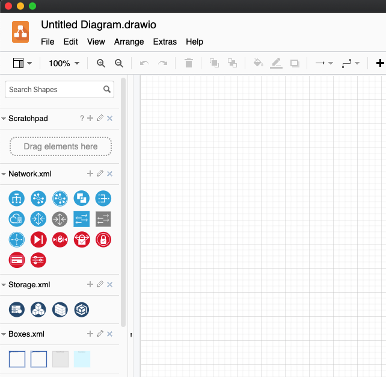
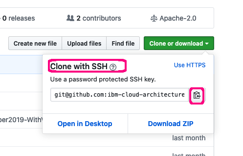
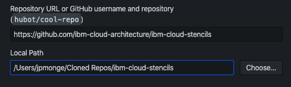

# Importing Stencil Libraries into Draw.io

This easy guide provides instructions to import stencils published in this repository (**drawio folder**) into the draw.io.
Stencils/icons are added and grouped using libraries, the libraries can contain one or several stencils, these are saved and generated in XML format (.xml). To use these these custom libraries, they first must be imported in order to make them available in the draw.io utility. 

## Import Guides

<details><summary>Import using Download Zip</summary>
<p>

- To download all contents of the repository, navigate to the main [page](https://github.com/ibm-cloud-architecture/ibm-cloud-stencils), click the **Clone or download** button and then select **Download ZIP**. Optionally, navigate directly to the [stencils](https://github.com/ibm-cloud-architecture/ibm-cloud-stencils/tree/master/drawio/stencils) folder in github, right click in the XML file you wish to download and select **Save Link As**, choose or browse your desired downloads directory. Repeat as necessary for each XML file.

- Go to your downloads directory and extract the ZIP file contents and access the folder called **drawio**, it should be located in the following path:

`YourDownloadsDirectory/ibm-cloud-stencils-master/drawio`

- Confirm XML file(s) you wish to import are visible inside the the drawio folder in your downloads directory:


- Open the desktop [Draw.io application](https://github.com/jgraph/drawio-desktop/releases) in your computer or open [draw.io](https://www.draw.io/) in your browser.

- Select **Create New Diagram**, then click **Create**.

- Click on **File > Open Library**, browse your drawio folder in your downloads directory and select the XML file, then click on **Open**. Repeat for every additional XML file you wish to import.

- Confirm library or libraries are visible in the left panel:



</p>
</details>


<details><summary>Import using Github Clone</summary>
<p>

Prerequistes

- A [GitHub.com account](https://github.com/).
- Git [CLI](https://gist.github.com/derhuerst/1b15ff4652a867391f03) or [GitHub Desktop](https://desktop.github.com/).
- An [SSH Key associated](https://help.github.com/en/github/authenticating-to-github/adding-a-new-ssh-key-to-your-github-account) to the github.com account

- Sign into [github](https://github.com/login?return_to=%2Fibm-cloud-architecture%2Fibm-cloud-stencils).
- While in the main [page](https://github.com/ibm-cloud-architecture/ibm-cloud-stencils), click the **Clone or download** button, select on **Use SSH** if not already selected (**Use HTTPS** will be displayed) and then copy the link using the copy symbol:



- CD to directory where you wish to clone this repository.

- Clone the repository using **git clone** syntax using the previously copied ssh link:

```
$ git clone git@github.com:ibm-cloud-architecture/ibm-cloud-stencils.git
Cloning into 'ibm-cloud-stencils'...
Enter passphrase for key '/Users/youruserid/.ssh/id_rsa': 
```
- Enter the passphrase of your SSH key.

- Confirm repository was successfully cloned, the CLI should display something like this:

```
remote: Enumerating objects: 58893, done.
remote: Total 58893 (delta 0), reused 0 (delta 0), pack-reused 58893
Receiving objects: 100% (58893/58893), 185.09 MiB | 5.01 MiB/s, done.
Resolving deltas: 100% (18944/18944), done.
$ 
```
- Optionally use GitHub Desktop to Clone. In the main [page](https://github.com/ibm-cloud-architecture/ibm-cloud-stencils), click the **Clone or download** button, select on **Open in Desktop**, wait for the prompt and select/confirm launching the link using GitHub Desktop application. Confirm directory where repository will be cloned:

  

  Click on **Clone** and wait for process to complete.

- Open the desktop [Draw.io application](https://github.com/jgraph/drawio-desktop/releases) in your computer or open [draw.io](https://www.draw.io/) in your browser.

- Select **Create New Diagram**, then click **Create**.

- Click on **File > Open Library**, browse your drawio folder in your cloned/local  directory and select the XML file, then click on **Open**. Repeat for every additional XML file you wish to import.

- Confirm library or libraries are visible in the left panel:


</p>
</details>